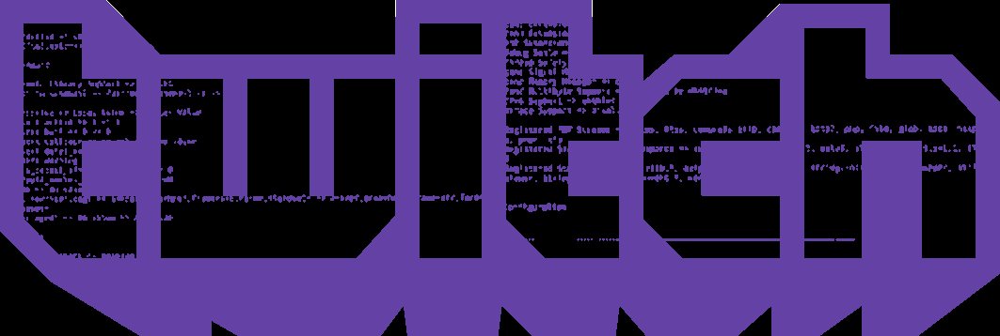
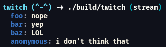

<h1 align="center">Twitch chat CLI</h1>

<div align="center"></img></div>

### What is that ?

Twitch chat cli is a cli tool to list the chat of some twitch stream.

### Install
To install you just have to clone this repository or get the binary in <a href="https://github.com/LuisHenriqueFA14/twitch-chat-cli/releases/tag/production">releases page</a>:

By compiling:
```
git clone https://github.com/LuisHenriqueFA14/twitch-chat-cli.git

cd twitch-chat-cli

chmod +x scripts/build.sh

./scripts/build.sh
```

By binary:
```
mv <binary_name> twitch

chmod +x <twitch>
```

### Usage

You can use it by typing `twitch <stream>`

Example:
```
twitch theprimeagen
```

### How does it look like ?

<div align="center">  </div>

